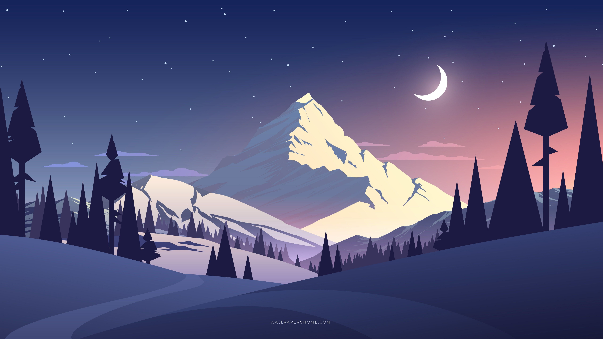

# This is a test header
And here is just some test text
_blablablablablablablablabla

---

This is **slide 2** of the test
Lets see if this is going to work
Tester**oooooooooooooooooo**

---

This is the last slide
Plants need CO2

-Bruce Wayne

---

